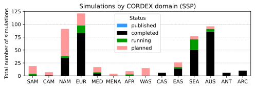
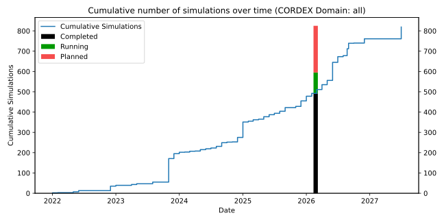

CORDEX simulation status
========================
This repository stores a machine-readable version ([CMIP6_downscaling_plans.csv](./CMIP6_downscaling_plans.csv)) of the CORDEX CMIP6 downscaling plans, as provided by the modelling groups.
It also renders the information formatted as HTML tables (see https://wcrp-cordex.github.io/simulation-status).

Additionally, this repository maintains a collection of [CORDEX-CMIP6 data servers](https://wcrp-cordex.github.io/simulation-status/CORDEX_CMIP6_data_servers.html) in [CORDEX_CMIP6_data_servers.yaml](./CORDEX_CMIP6_data_servers.yaml), including servers that are not (yet) on ESGF.

How to contribute
-----------------
You can add or update your simulations by opening an [issue](https://github.com/WCRP-CORDEX/simulation-status/issues/new) or PR in this repository

To add a CORDEX-CMIP6 data server, edit [CORDEX_CMIP6_data_servers.yaml](./CORDEX_CMIP6_data_servers.yaml) and submit a PR or open an issue with the server details (domain, institution, URL, availability type, and comment).

Current global status
---------------------

