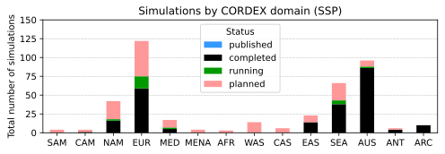
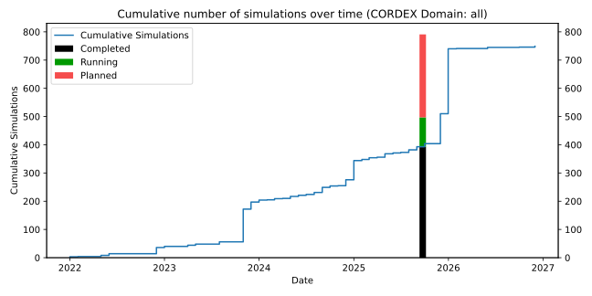

CORDEX simulation status
========================
This repository stores a machine-readable version ([CMIP6_downscaling_plans.csv](./CMIP6_downscaling_plans.csv)) of the CORDEX CMIP6 downscaling plans, as provided by the modelling groups.
It also renders the information formatted as HTML tables (see https://wcrp-cordex.github.io/simulation-status).

How to contribute
-----------------
You can add or update your simulations by opening an [issue](https://github.com/WCRP-CORDEX/simulation-status/issues/new) or PR in this repository

Current global status
---------------------

